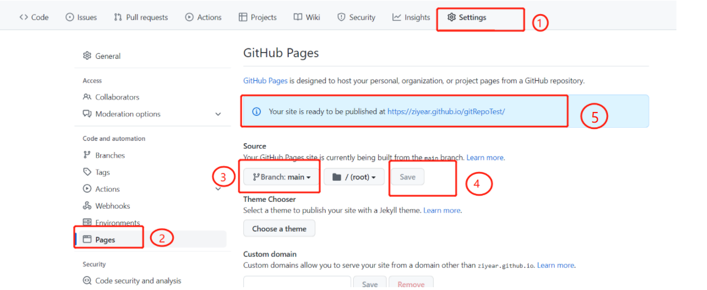

### 1、在github创建一个maven项目
### 2、编写pom文件
```xml
    <distributionManagement>
        <repository>
            <id>local-repo-release</id>
            <name>GitHub Release</name>
            <url>file://${project.basedir}/maven-repo</url>
        </repository>
    </distributionManagement>

    <build>
        <plugins>
            <plugin>
                <artifactId>maven-source-plugin</artifactId>
                <executions>
                    <execution>
                        <id>attach-sources</id>
                        <phase>package</phase>
                        <goals>
                            <goal>jar-no-fork</goal>
                        </goals>
                    </execution>
                </executions>
            </plugin>
            <plugin>
                <artifactId>maven-javadoc-plugin</artifactId>
                <executions>
                    <execution>
                        <id>attach-javadocs</id>
                        <phase>package</phase>
                        <goals>
                            <goal>jar</goal>
                        </goals>
                    </execution>
                </executions>
            </plugin>
        </plugins>
    </build>

```
### 3、执行部署命令
```shell
mvn deploy
```
### 4、提交代码到github

### 5、配置GitHub Pages

这样，把全部内容推送至GitHub后，即可作为静态网站访问Maven的repo

它的地址是 https://ziyear.github.io/gitRepoTest/maven-repo/

版本1.0.0对应的jar包地址是：
https://ziyear.github.io/gitRepoTest/maven-repo/org/example/gitRepoTest/1.0.0/gitRepoTest-1.0.0.jar

现在，如果其他人希望引用这个Maven包，我们可以告知如下依赖即可：
```xml
<dependency>
    <groupId>org.example</groupId>
    <artifactId>gitRepoTest</artifactId>
    <version>1.0.0</version>
</dependency>
```

但是，除了正常导入依赖外，对方还需要再添加一个<repository>的声明，即使用方完整的pom.xml如下：

```xml
    <repositories>
        <repository>
            <id>github-rich-repo</id>
            <name>The Maven Repository on Github</name>
            <url>https://ziyear.github.io/gitRepoTest/maven-repo/</url>
        </repository>
    </repositories>
```